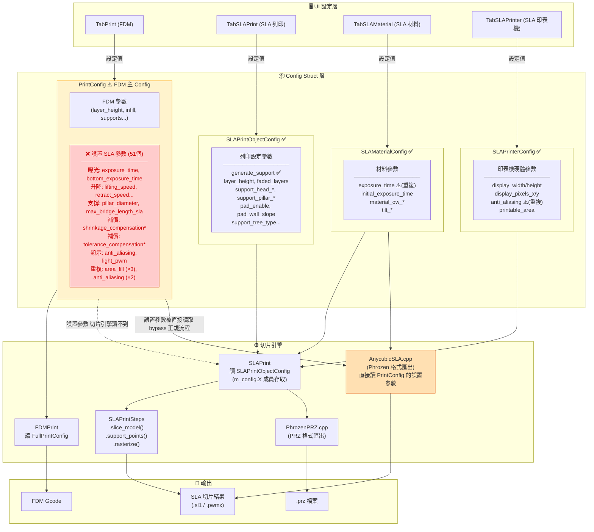
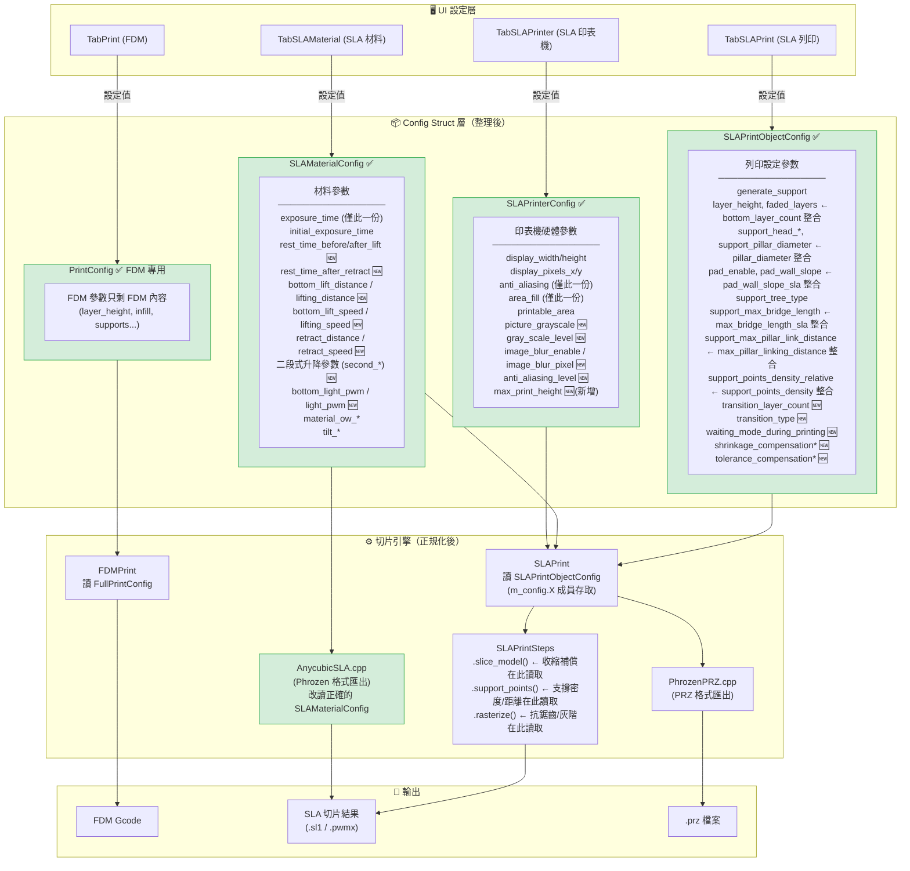
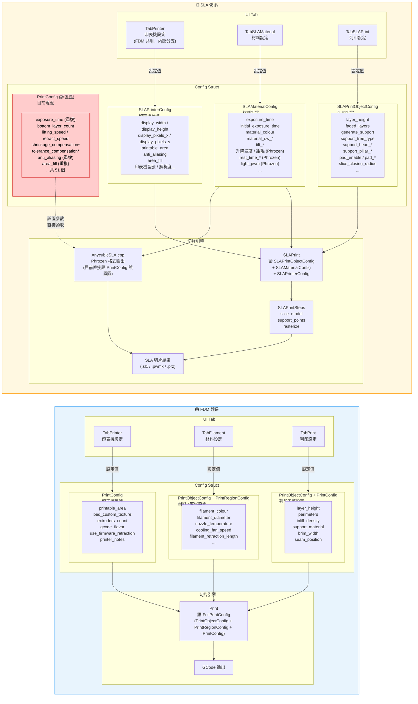

# SLA 參數架構圖

**建立日期**: 2026-03-22
**說明**: 對照圖，顯示現況與建議架構差異

---

## 圖 1：目前 PhrozenOrca 參數放置現況與切片流程

### 問題摘要

| 問題 | 影響 |
|---|---|
| 51 個 SLA 參數放在 `PrintConfig`（FDM struct）| SLAPrint.cpp 無法透過 `m_config.X` 讀取 |
| AnycubicSLA.cpp 直接讀 PrintConfig 的誤置參數 | Bypass 正規切片流程，只有匯出時才生效 |
| `anti_aliasing` 重複定義（PrintConfig + SLAPrinterConfig）| 不確定哪個版本被使用 |
| `area_fill` 三重重複 | 同上 |
| `exposure_time` 兩個版本 | SLAMaterialConfig 版本正確，PrintConfig 版本是無用重影 |

---

## 圖 2：建議架構（SLA 參數移到正確位置後）

### 整理後的改善點

| 改善項目 | 說明 |
|---|---|
| ✅ PrintConfig 只剩 FDM 參數 | SLA 參數全部遷移至對應的 SLA struct |
| ✅ SLAPrint.cpp 可透過 `m_config.X` 直接存取所有參數 | 不再需要繞路 |
| ✅ AnycubicSLA.cpp 改讀 SLAMaterialConfig | 與正規切片流程共用同一份資料來源 |
| ✅ 重複定義全部消除 | anti_aliasing、area_fill、exposure_time 各只有一份 |
| 🆕 新增 `max_print_height` | 印表機高度限制 |
| 🆕 收縮補償/公差補償連接 rasterize 步驟 | 切片時真正套用 |
| 🆕 二段式升降 / rest_time 移入 SLAMaterialConfig | 匯出時從正確位置讀取 |

---

## 遷移工作量速估

| 工作項目 | 影響範圍 | 估計複雜度 |
|---|---|---|
| 移除 PrintConfig 中的重複定義 | PrintConfig.hpp + .cpp | 低 |
| 51 個參數搬移至正確 struct | PrintConfig.hpp | 中 |
| AnycubicSLA.cpp 改讀正確 struct | Format/AnycubicSLA.cpp | 中 |
| SLAPrintSteps.cpp 新增讀取補償/灰階參數 | SLAPrintSteps.cpp | 高 |
| Profile JSON key 同步更新 | resources/profiles/ | 低 |
| Preset.cpp dirty check list 更新 | Preset.cpp | 低 |

---

## 圖 3：FDM 與 SLA 完整參數分佈對照

### 關鍵差異對照

| | FDM | SLA |
|---|---|---|
| 印表機 Tab | `TabPrinter` | `TabPrinter`（共用，內部 branch）|
| 材料 Tab | `TabFilament` | `TabSLAMaterial` |
| 列印設定 Tab | `TabPrint` | `TabSLAPrint` |
| 印表機 Config Struct | `PrintConfig` | `SLAPrinterConfig` |
| 材料 Config Struct | `PrintObjectConfig` / `PrintRegionConfig` | `SLAMaterialConfig` |
| 列印設定 Config Struct | `PrintObjectConfig` / `PrintConfig` | `SLAPrintObjectConfig` |
| 切片引擎讀取 | `FullPrintConfig`（三者合一）| `SLAFullPrintConfig`（三者合一）|
| 現況問題 | 無 | 51 個 SLA 參數誤置在 FDM 的 `PrintConfig` |
