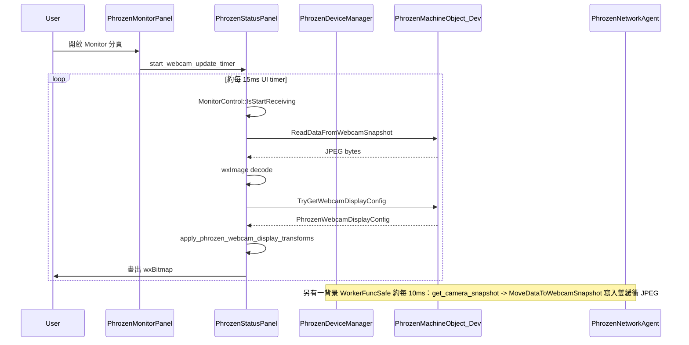
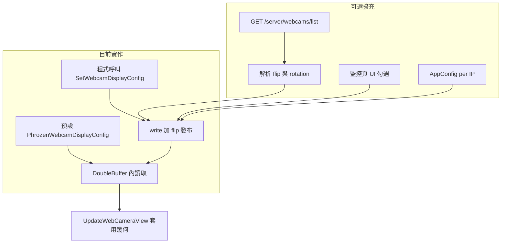

# Webcam display transforms (Phrozen monitor) — 修改紀錄

本文件記錄 Phrozen 監控頁 **即時鏡頭預覽** 之水平／垂直翻轉與旋轉的程式面變更。  
顯示邏輯對齊 **Moonraker** 欄位語意（`flip_horizontal`、`flip_vertical`、`rotation`），實際數值目前由本機狀態驅動；日後可接上 `GET /server/webcams/list` 或 UI。

## 背景

- **先前行為**：`PhrozenStatusPanel::UpdateWebCameraView` 對所有 JPEG 固定執行 `Rotate180()`，無法對應不同鏡頭安裝方向或 Moonraker 設定。
- **Moonraker**：`/server/webcams/list` 回傳之 `flip_*` 與 `rotation` 為 **前端顯示** 用 metadata，串流／snapshot 位元組本身不變。見 [Webcam Management API](https://moonraker.readthedocs.io/en/latest/external_api/webcams/)。
- **目標**：以可設定之 `PhrozenWebcamDisplayConfig` 取代寫死旋轉，並提供 thread-safe 讀寫，供監控 UI 與日後連線同步使用。

## Moonraker API 參考資料

與本功能相關之官方說明（HTTP 與 JSON-RPC 對應關係見總覽）：

| 主題 | 說明 | 連結 |
|------|------|------|
| External API 總覽 | HTTP／JSON-RPC／Websocket 行為、回應格式、`POST /server/jsonrpc` | [Introduction](https://moonraker.readthedocs.io/en/latest/external_api/introduction/) |
| Webcam 管理 | `GET /server/webcams/list`、`GET /server/webcams/item`、`POST /server/webcams/item`、`POST /server/webcams/test`；`flip_horizontal`／`flip_vertical`／`rotation` 欄位定義 | [Webcam Management](https://moonraker.readthedocs.io/en/latest/external_api/webcams/) |
| 授權 | API Key（`X-Api-Key`）、JWT、oneshot token 等（遠端連線若啟用驗證需對齊 HTTP 與 websocket） | [Authorization](https://moonraker.readthedocs.io/en/latest/external_api/authorization/) |

對應之 JSON-RPC 方法名稱見 [Webcam Management](https://moonraker.readthedocs.io/en/latest/external_api/webcams/) 各節（例如 `server.webcams.list`、`server.webcams.get_item`、`server.webcams.post_item`）。

## 操作流程圖

### 監控頁即時預覽（執行期資料流）

### 顯示設定從哪裡來（目前 vs 可擴充）

**說明**：JPEG 取樣與顯示設定為兩條線；設計變更不需更動 `get_camera_snapshot` 頻率，只要在任何時機 `SetWebcamDisplayConfig` 即可讓下一幀預覽套用新方向。

## 變更概要

| 項目 | 說明 |
|------|------|
| 資料結構 | 新增 `Slic3r::PhrozenWebcamDisplayConfig`（`flip_horizontal`、`flip_vertical`、`rotation_deg`） |
| 狀態持有者 | `PhrozenMachineObject_Dev` 使用 `DoubleBufferSP<PhrozenWebcamDisplayConfig>` |
| API | `TryGetWebcamDisplayConfig`、`SetWebcamDisplayConfig`（rotation 正規化為 0 / 90 / 180 / 270） |
| 顯示 | `apply_phrozen_webcam_display_transforms`：先 rotation，再水平／垂直 `Mirror`；無效 JPEG 提早 return |

## 修改檔案列表

| 檔案 | 用途 |
|------|------|
| `src/slic3r/Utils/Phrozen/PhrozenMachineDatas.hpp` | 定義 `PhrozenWebcamDisplayConfig` |
| `src/slic3r/GUI/PhrozenGUI/PhrozenDeviceManager.hpp` | 宣告 getter／setter 與 double-buffer 成員 |
| `src/slic3r/GUI/PhrozenGUI/PhrozenDeviceManager.cpp` | 實作 `SetWebcamDisplayConfig`（含 rotation normalize） |
| `src/slic3r/GUI/PhrozenGUI/PhrozenStatusPanel.cpp` | 解 JPEG 後套用設定，移除無條件 `Rotate180()` |

## 行為差異（與舊版）

- **預設**：不翻轉、`rotation_deg = 0`（與先前「一律 180°」不同）。
- 若需維持舊畫面方向，可在連線成功後對目前機台物件呼叫一次，例如：  
  `SetWebcamDisplayConfig({ false, false, 180 })`（實際呼叫點由產品決定）。

## 幾何順序

實作順序為：**rotation（0 / 90 / 180 / 270，順時針語意）→ `flip_horizontal` → `flip_vertical`**。  
若需與 Fluidd／Mainsail 完全一致，請以實機同一幀比對後再微調順序。

## 後續可選工作

- 連線時呼叫 Moonraker `GET /server/webcams/list`，將回傳之 flip／rotation 寫入 `SetWebcamDisplayConfig`。
- 監控頁提供 checkbox／旋轉選項並寫入 `AppConfig`（per 印表機 IP）。
- `PhrozenNetworkAgent::get_camera_snapshot` 改用 list 解析後之 `snapshot_url`（含相對路徑組合）。

---

*Document version: aligns with Phrozen branch changes introducing `PhrozenWebcamDisplayConfig` and configurable monitor preview transforms.*
